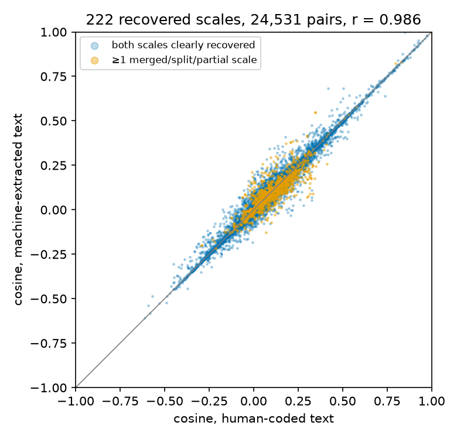

# Do extraction errors change what the search engine indexes? Summary

Summary of [`embedding_fidelity.py`](embedding_fidelity.py) (outputs in `output/embedding_fidelity/`, no item text):

```
HF_TOKEN=... poetry run python analyses/embedding_fidelity.py                       # validity run
HF_TOKEN=... poetry run python analyses/embedding_fidelity.py \
    --postprocessed <synthometricon-corpus-postprocessed.parquet> \
    --exploded <apa-psyctests-extractions-exploded.parquet>                          # what the index holds
```

We embedded the human-coded fixtures of the 100 audited PsycTests documents (`tests/validation-fixtures`) and machine
extractions of the same documents with SurveyBot3000, pooled the items as the engine does (unit-normalised item
vectors, reverse-keyed items negated, averaged), and compared the two. There are two machine sides:

- **Validity run** (`logs/test-validity-20260815_172054.md`): the extraction checked in the validity evaluation, an
  independent run of the production model and prompts on the audited documents.
- **Index** (production): the postprocessed rows the search index pools, available for the 73 audited documents the
  index holds. The other 27 were never extracted (12; their PsycTests record has `TestItemsAvailable = No`) or were
  removed in postprocessing (15).

As in the validity evaluation, we excluded the 12 documents whose validity failures were traced to errors in the
human coding (the 11 noted in the validity log, plus 022, whose fixture merges multi-part questions into single items
of 330 to 750 characters). The validity run produced no output for 018 and 022 (truncated JSON), so they have no
machine side there; 018 is a transient failure (its production extraction matches the fixture).

Brackets give 95% confidence intervals: for r and RMSE a document-level cluster bootstrap (1,000 resamples of the documents with recovered scales, percentile intervals, seed 20261002; each resample forms all pairs among the drawn documents' scales), for shares a Wilson score interval.

## Two numbers (validity run)

| | Result |
|---|---|
| Coverage: human-coded scales not in the extraction | 1 of 223 (0.4%): a single-item subscale whose item text was not transcribed (138); recovered 99.6% [97.5%, 99.9%] |
| Agreement: cosines among all pairs of the 222 recovered scales, human-coded vs machine-extracted text | r = .986 [.975, .996], RMSE = .025 [.014, .036] (24,531 pairs, scale–subscale pairs included) |



Of the 222 recovered scales, 216 had a clear counterpart (at least half of their items in one machine scale), 3 were
paired with a partially overlapping scale, and 3 only with the instrument row. Breakdown of the agreement (pairs):

| Pairs | n | r | RMSE |
|---|---|---|---|
| Both scales clearly recovered (≥ half of items shared) | 23,220 | .989 [.979, .997] | .022 [.012, .033] |
| At least one merged, split, partial or instrument-row counterpart | 1,311 | .886 [.674, .981] | .053 [.029, .079] |
| Both from documents that passed the validity check | 17,020 | .997 [.994, .999] | .012 [.006, .017] |
| At least one from a document with a genuine discrepancy | 7,511 | .960 [.918, .988] | .041 [.025, .054] |
| Search-relevant pairs (abs. human cosine ≥ .30) | 2,013 | .991 [.982, .998] | .031 [.014, .050] |

## What the index holds (production)

Output in `output/embedding_fidelity/production/`. Of the 226 assessable human-coded scales in documents without
fixture errors (223 above plus 3 in 018), 160 (in 67 documents) are in documents the index holds; 23 (8 documents)
were removed in postprocessing and 43 (11 documents) were never extracted. For a like-for-like comparison, the
validity run is restricted to the same documents (66; 018 has no validity-run output):

| Same 66 documents, 157 human-coded scales | Index (postprocessed) | Validity run |
|---|---|---|
| Not found | 1 (138) | 1 (138) |
| Counterparts: clear / partial / instrument row only | 142 / 6 / 8 | 152 / 3 / 1 |
| All pairs (12,090): r, RMSE | .967 [.932, .994], .044 [.020, .076] | .987 [.974, .997], .026 [.013, .040] |
| Search-relevant pairs (abs. human cosine ≥ .30; 1,351 vs 1,353): r, RMSE | .961 [.854, .997], .073 [.020, .144] | .992 [.983, .999], .031 [.011, .055] |
| Pairs from documents that passed the validity check (8,001): r, RMSE | .969 [.923, .999], .043 [.007, .083] | .998 [.996, 1.000], .012 [.006, .017] |

With 018 (67 documents, 160 scales): 159 recovered (99.4% [96.5%, 99.9%]), 12,561 pairs, r = .968 [.927, .994], RMSE = .044 [.019, .078]; search-relevant pairs (1,354): r = .962 [.851, .997], RMSE = .073 [.021, .145]. These use the final postprocessed corpus (the local assembly rerun of 2 Oct 2026); the point estimates are identical to those on the 25 Sep release. The production extraction is
an independent draw (temperature 1) and differs from the validity run for some documents. The lower agreement comes
almost entirely from two documents (004, 040) whose production extraction left several subscales' items as orphans,
so those subscales are found only through the instrument row; without them, r = .988 and RMSE = .026 (9,453 pairs).
Postprocessing is not the cause: the production extraction before postprocessing (`--exploded`, same 66 documents)
gives r = .968, RMSE = .044. "Passed" refers to the validity-run outcome of a document; 004 and 040 passed there.

## Definitions

- **In the index (recovered):** at least one of the scale's items appears in any row the index holds for its document,
  i.e., a machine scale node or the instrument row (all scaled and orphan items; unscaled items are dropped in
  postprocessing and do not count). Items correspond if their texts are at least 80% similar (normalised Levenshtein)
  or one contains the other (e.g., an omitted shared stem), matched one-to-one.
- **Counterpart:** the index row sharing the most of the scale's items (item-set Jaccard). Several human-coded scales
  may share one row (merges), and partial overlap counts (splits, omissions), so these distortions enter the agreement
  number rather than the coverage number.
- **Coverage loss:** scales with no item in the index.
- Fixture conventions are respected: `!contains` texts are replaced by the matched machine text, `!extras=N`
  untranscribed items are filled from the matched machine scale, and unrecorded keying takes the machine's value.
  Because these conventions borrow from the machine side, the human vectors differ slightly between the two machine
  sides (hence 1,351 vs 1,353 search-relevant pairs).
- Index rows are rebuilt from the postprocessed corpus as `assemble/pool.py` builds them: items keyed by
  `item_item_id`, each scale node pooling its own and its descendants' items, the instrument row pooling all of them.

## Caveats

- Documents that were never extracted or were removed in postprocessing count against coverage in the corpus
  coverage statistics (Supplementary Note 6), not here.
- Four scales in documents without item text on the human side (031, 033, 038) cannot be assessed.
- For context: SurveyBot3000 predicts empirical scale correlations with RMSE = .16 (Hommel & Arslan, 2025), so the
  extraction adds little error by comparison, in either machine side.

## Draft text

Of the 223 human-coded scales, 222 were present in the machine extraction of the same document (validity run), i.e.,
at least one of their items was extracted. We paired each with the extracted scale sharing the most items, so merged,
split, or partially extracted scales count as recovered. The one missing scale was a single-item subscale whose item
text was not transcribed. Across all pairs of recovered scales (24,531 pairs), cosines computed from machine-extracted
text correlated r = .99 with those computed from human-coded text (RMSE = .025). For the 66 of these documents that the
search index holds, the production extraction gives r = .97 (RMSE = .044); the difference comes almost entirely from
two documents in which the production run left subscale items unassigned.
