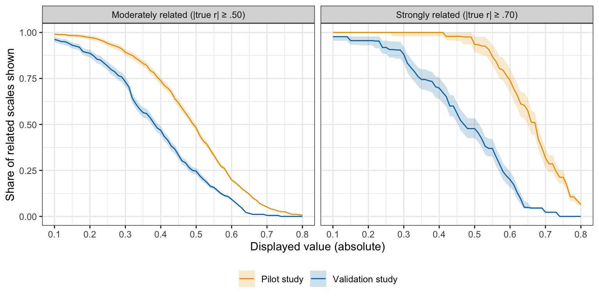
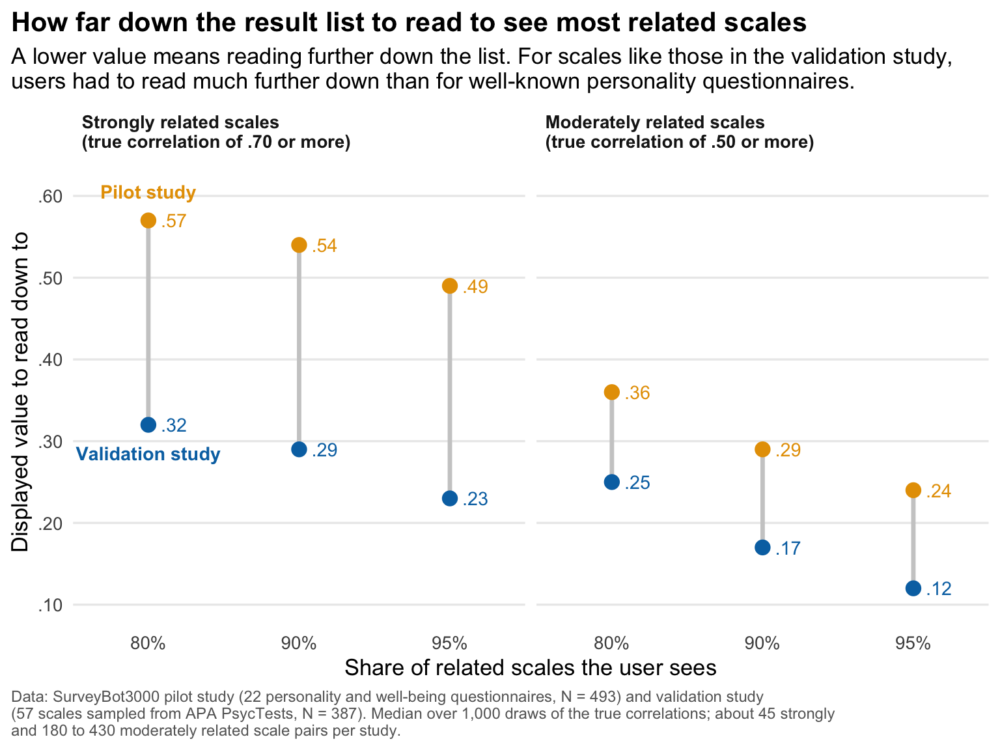

# How often Synthometricon shows related scales: summary

Summary of [`search_validity.Rmd`](search_validity.Rmd), which renders to `search_validity.html`
(`Rscript -e 'rmarkdown::render("analyses/search_validity.Rmd")'`). The inputs are the published
data of the SurveyBot3000 paper; the Rmd downloads them from the SurveyBot3000 repositories, pinned
to a commit. The pilot study (22 well-known personality and well-being questionnaires, 113 scales,
N = 493) is probably a best case. The validation study (57 scales sampled from APA PsycTests,
N = 387) is closer to the database as a whole. A related scale counts as shown at a displayed value
if it reaches that value with the correct sign.

## Key numbers

Share of related scales shown at or above a displayed value (95% intervals in the report):

| True correlation at least | Study | Pairs | Shown at .30 | Shown at .40 | Shown at .50 |
|---|---|---|---|---|---|
| .70 | Pilot | 46 | 1.00 | 1.00 | .93 |
| .70 | Validation | 44 | .88 | .70 | .48 |
| .50 | Pilot | 431 | .89 | .74 | .48 |
| .50 | Validation | 182 | .73 | .47 | .25 |

Displayed value a user needs to read down to in order to see 80%, 90% or 95% of the related scales:

| True correlation at least | Share | Pilot | Validation |
|---|---|---|---|
| .70 | 80% | .57 | .32 |
| .70 | 90% | .54 | .29 |
| .70 | 95% | .49 | .23 |
| .50 | 80% | .36 | .25 |
| .50 | 90% | .29 | .17 |
| .50 | 95% | .24 | .12 |

The validation study needs a much lower cutoff although its accuracy is similar (.83 vs .87),
mainly because its displayed values are compressed toward zero: a pair with a true correlation of
.70 is displayed at about .43 on average, against .57 in the pilot study.

Short queries, validation study (full scale in parentheses):

| Query items | Scales | Accuracy | Strongly related shown at .30 |
|---|---|---|---|
| 1 | 57 | .72 (.83) | .73 (.88) |
| 2 | 57 | .80 (.83) | .77 (.88) |
| 3 | 32 | .81 (.85) | .78 (.85) |
| 5 | 20 | .84 (.86) | .83 (.91) |

In the pilot study, short queries cost little: single items still showed 95% of the strongly
related scales at .30.

## Proposed default marker

A line at a displayed value of .30, labelled along the lines of "strongly related scales rarely
appear below this line". In the validation study 9 of 10 scales with a true correlation of .70 or
more were shown at or above .30, and in the pilot study all of them. The line is not a relevance
threshold: many unrelated scales will also score above it. We do not suggest rescaling the
displayed values: the two studies would call for different rescalings, and the .30 line is already
set by the more compressed validation study.

## Draft FAQ text: "How trustworthy and accurate are the results?"

Synthometricon estimates how strongly your items would correlate with each scale in the database if
both were given to the same people. We checked these estimates against real data in two studies. In
the first, with 22 well-known personality and well-being questionnaires (493 participants), the
estimates correlated .87 with the observed correlations between scales. In the second, with 57
scales drawn from the database (387 participants), they correlated .83. A typical estimate was off by
about .12 in the first study and .16 in the second. The first study is a best case; the second is
closer to what you can expect for the database as a whole.

**Will I find scales that measure something very similar to mine?** Of 10 scales that truly correlate
.70 or more with yours, about 9 appeared with a displayed value of .30 or higher in the second study,
and about 7 at .40 or higher. In the first study, all of them reached .40. Of scales that correlate
.50 or more, about 7 in 10 appeared at .30 or higher in the second study. If nothing in your results
lies above .30, a strongly overlapping measure is unlikely, but not ruled out.

**How far down the list should I read?** To see 9 in 10 of the scales that truly correlate .70 or more
with yours, read down to a displayed value of about .30. For scales that correlate .50 or more, the
same share requires reading down to about .17. For well-known personality measures, about .55 and
.30 were enough. The engine shows how many results lie above any value, and the filter box helps
narrow long lists.

**Does it matter how many items I enter?** Yes. With a single item, 7 in 10 strongly related scales
reached .30 in the second study, compared with 9 in 10 when the full scale was entered. Enter more
than one item if you can; the more items, the closer the results come to those for a full scale.

## Draft methods paragraph

To describe how often related scales appear in Synthometricon's result list, we reused the scale
pairs of the pilot (113 scales, 6,245 pairs) and validation studies (57 scales, 1,568 pairs). A pair
counted as related if its true correlation was at least .50 (or .70) in absolute value, and as shown
at a displayed value *c* if its synthetic correlation had the correct sign and an absolute value of
at least *c*. To account for sampling error in the empirical correlations, we drew each pair's true
correlation 1,000 times from a normal distribution with the observed correlation as its mean and its
standard error as its standard deviation, and report medians and 95% intervals across draws. To
examine short queries, we drew up to 10 random sets of 1, 2, 3 or 5 items from each scale, scored
each set against all other scales in the same study, and compared accuracy and the share of related
scales shown with those of the full scales the items were drawn from.

## Caveats

- Each study contains only about 45 strongly related pairs, so shares for true correlations of .70
  or more are estimated from few pairs.
- The share of related scales shown does not depend on the size of the database, but the number of
  other results a user has to screen does. This analysis does not estimate that number; the engine
  reports it for each query.
